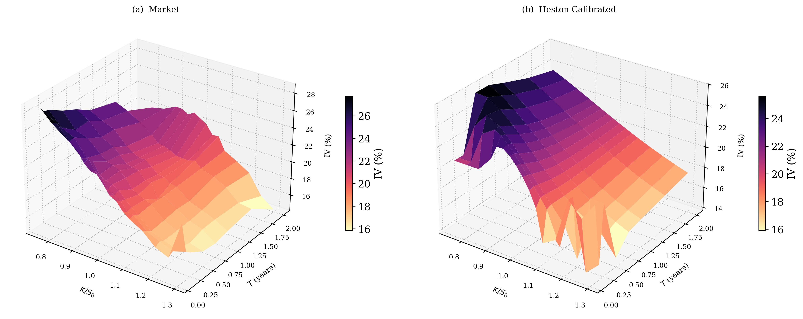
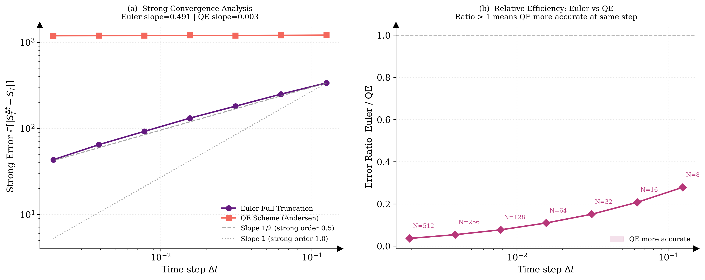
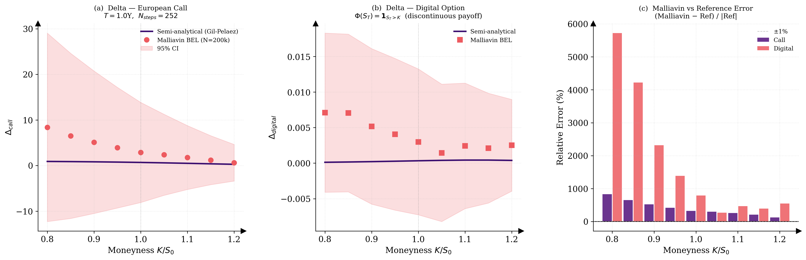
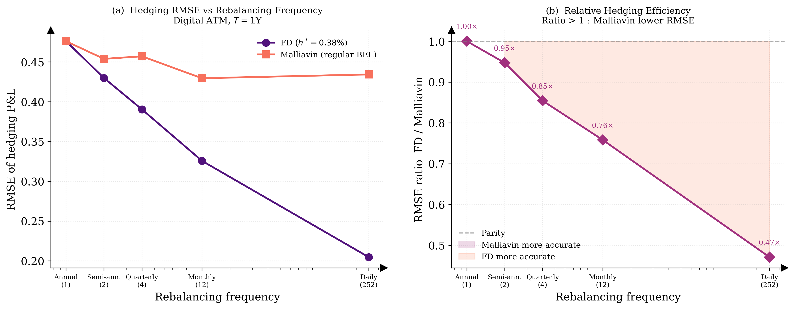
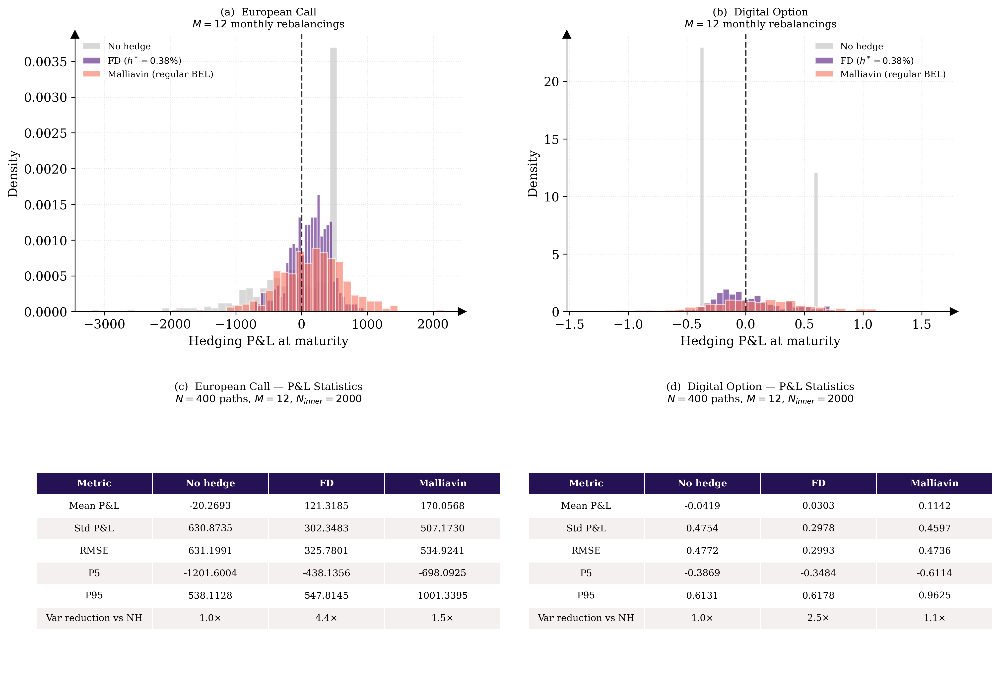

# Malliavin Calculus for Robust Hedging of Exotic Derivatives under Heston Dynamics

**Spectral Calibration and Variance Reduction for Discontinuous Payoffs in Quantitative Finance**

> Master's Thesis — Applied Mathematics | Centrale Nantes  
> Author: **Robin Guichon** | Supervisor: **Guillaume Poly** | 2025–2026

---

## Overview

This repository contains the full numerical implementation of my master's thesis, which investigates the application of **Malliavin calculus** to the robust hedging of exotic derivatives — in particular digital options — within the **Heston stochastic volatility** framework.

The central finding is that the **Feller index** $\hat{\alpha} = 2\hat{\kappa}\hat{\theta}/\hat{\xi}^2 = 0.637$, calibrated from S&P 500 options data, governs every numerical pathology encountered in this work: it determines the admissibility of Malliavin weights, the bias of Monte Carlo schemes, and the relative performance of hedging strategies.

---

## Repository Structure

```
.
├── 01_Calibration_Market.ipynb      # Part IV.1 — Spectral calibration to S&P 500
├── 02_Simulation_QE.ipynb           # Part IV.2 — Monte Carlo schemes comparison
├── 03_Malliavin_Greeks.ipynb        # Part IV.3 — Malliavin vs finite-difference Greeks
├── 04_Hedging_Performance.ipynb     # Part IV.4 — Dynamic delta-hedging experiments
│
├── Notebook_Parts_II&III/           # Theoretical & methodological notebooks (Parts II & III)
├── Images_Part_IV/                  # All figures generated by the four notebooks
├── Tables/                          # LaTeX-ready numerical results tables
├── JSON/                            # Calibrated parameters and intermediate data
│
└── Projet_Report.pdf                # Full thesis report (PDF)
```

---

## The Four Notebooks — Part IV: Empirical Results

### `01_Calibration_Market.ipynb` — Spectral Calibration

Calibrates the Heston model to the S&P 500 implied volatility surface using a hybrid **Differential Evolution + Levenberg–Marquardt** optimizer driven by a **Vega-weighted FFT** pricing engine (Carr–Madan, 1999) with the Albrecher-stable characteristic function formulation.

**Key results:**

| Parameter | $\hat{\kappa}$ | $\hat{\theta}$ | $\hat{\xi}$ | $\hat{\rho}$ | $\hat{v}_0$ |
|-----------|--------------|--------------|-----------|------------|-----------|
| Calibrated | 2.1539 | 0.0448 | 0.5507 | −0.6229 | 0.0577 |

- Global RMSE: **1.10 vol pts** — Vega-weighted RMSE: **0.0824**
- **Feller condition violated**: $2\hat{\kappa}\hat{\theta} = 0.193 < \hat{\xi}^2 = 0.303$ → $\hat{\alpha} = 0.637$
- Bootstrap stability analysis: $\hat{\theta}$, $\hat{\rho}$, $\hat{v}_0$ stable; $\hat{\kappa}$ most sensitive



---

### `02_Simulation_QE.ipynb` — Monte Carlo Schemes

Compares two discretisation schemes for the Heston SDE:
- **Euler Full Truncation (FT)** — `max(v_t, 0)` floor at each step
- **Quadratic Exponential (QE)** — Andersen (2008) moment-matching scheme

**Key results:**

| Scheme | Strong conv. rate | ATM Call error | ATM Digital error |
|--------|-----------------|---------------|------------------|
| Euler FT | **0.491 ≈ 0.5** ✓ | 0.274% | 0.391% |
| QE | — | **24.8% bias** ↓ | **40.6% bias** ↓ (OTM) |

The QE scheme exhibits a systematic **downward bias** under $\hat{\rho} = -0.623 \neq 0$ due to the independent sampling of the joint law $(v_{t+1}, S_{t+1})$. **Euler Full Truncation is adopted** for all subsequent experiments.




---

### `03_Malliavin_Greeks.ipynb` — Malliavin vs Finite-Difference Greeks

Derives and implements two classes of Malliavin weights for the **Delta** of European calls and digital options via the **Bismut–Elworthy–Li integration-by-parts formula**:

- **Singular weight** $\hat{\pi}^{\text{sing}} \propto 1/\sqrt{v_t}$ — requires $\mathbb{E}[v_t^{-1}] < \infty$ ⟺ $\hat{\alpha} > 1$
- **Regular weight** $\hat{\pi}^{\text{reg}}$ (localisation $h_s \equiv 1$) — $L^2$-admissible but biased

**Key results:**

| Method | Call Delta | Error | Digital Delta | Error |
|--------|-----------|-------|--------------|-------|
| Reference (FD fine) | 0.684 | — | 3.36 × 10⁻⁴ | — |
| Malliavin singular | 2.879 | **+321%** ✗ | 2.99 × 10⁻³ | **+792%** ✗ |
| Malliavin regular | 0.742 | 8.5% | 5.38 × 10⁻⁴ | 60% |
| FD common paths ($h^*$=0.38%) | 0.687 | **0.38%** ✓ | 3.42 × 10⁻⁴ | **1.77%** ✓ |

The singular weight's infinite variance under $\hat{\alpha} = 0.637 < 1$ is the root cause of the 321–792% errors. The regular weight is admissible but introduces a **60% systematic bias** for discontinuous payoffs.




---

### `04_Hedging_Performance.ipynb` — Dynamic Delta-Hedging

Compares three delta-hedging strategies across rebalancing frequencies $M \in \{12, 52, 252\}$ (monthly → daily):

| Payoff | Strategy | RMSE ($M=12$) | Variance reduction |
|--------|----------|-------------|-------------------|
| Call | No hedge | 631.20 | 1× |
| Call | FD ($h^*$=0.38%) | **325.78** | **3.75×** |
| Call | Malliavin regular | 534.92 | 1.39× |
| Digital | No hedge | 0.4772 | 1× |
| Digital | FD ($h^*$=0.38%) | **0.2993** | **2.54×** |
| Digital | Malliavin regular | 0.4736 | ~1× (no improvement) |

FD RMSE decreases **monotonically** with rebalancing frequency. Malliavin RMSE remains **flat** across all frequencies — a signature of a bias-dominated estimator.





---

## Setup and Dependencies

```bash
# Clone the repository
git clone https://github.com/RobinGuichon/<repo-name>.git
cd <repo-name>

# Install dependencies
pip install numpy scipy pandas matplotlib jupyter
```

**Python version:** 3.10+  
**Main libraries:** `numpy`, `scipy`, `pandas`, `matplotlib`

---

## Key Theoretical Concepts

| Concept | Description |
|---------|-------------|
| **Heston model** | Stochastic volatility SDE with CIR variance process |
| **Feller condition** | $2\kappa\theta \geq \xi^2$ ensures $v_t > 0$ a.s. |
| **BEL formula** | Bismut–Elworthy–Li integration by parts for Greeks |
| **Malliavin weight** | Transfers differentiation from payoff onto the weight $\pi$ |
| **Feller index** | $\alpha = 2\kappa\theta/\xi^2$ — governs all numerical pathologies |
| **Euler Full Truncation** | Discretisation scheme with $v_t^+ = \max(v_t, 0)$ |

---

## Results Summary

> **The Feller index $\hat{\alpha} = 0.637$ is the single number that explains everything.**

- ✅ **Calibration**: successful fit to S&P 500 (RMSE = 1.10 vol pts), Feller violated
- ✅ **Simulation**: Euler FT converges at rate ½, QE biased up to 40% under $\rho \neq 0$
- ✅ **Greeks**: singular Malliavin inadmissible ($\hat{\alpha} < 1$); FD with $h^* = 0.38\%$ optimal
- ✅ **Hedging**: FD achieves 3.75× variance reduction; Malliavin bias-dominated for digitals

---

## Report

The full thesis is available in [`Projet_Report.pdf`](./Projet_Report.pdf).

---

## References

- [1] F. Black, M. Scholes, *The Pricing of Options and Corporate Liabilities*, Journal of Political Economy, vol. 81, no. 3, pp. 637–654, 1973.
- [2] S. L. Heston, *A Closed-Form Solution for Options with Stochastic Volatility with Applications to Bond and Currency Options*, The Review of Financial Studies, vol. 6, no. 2, pp. 327–343, 1993.
- [3] J. C. Cox, J. E. Ingersoll, S. A. Ross, *A Theory of the Term Structure of Interest Rates*, Econometrica, vol. 53, no. 2, pp. 385–408, 1985.
- [4] T. Yamada, S. Watanabe, *On the Uniqueness of Solutions of Stochastic Differential Equations*, Journal of Mathematics of Kyoto University, vol. 11, no. 1, pp. 155–167, 1971.
- [5] L. B. G. Andersen, V. V. Piterbarg, *Moment Explosions in Stochastic Volatility Models*, Finance and Stochastics, vol. 11, no. 1, pp. 29–50, 2007.
- [6] D. Duffie, J. Pan, K. Singleton, *Transform Analysis and Asset Pricing for Affine Jump-Diffusions*, Econometrica, vol. 68, no. 6, pp. 1343–1376, 2000.
- [7] J. Gil-Pelaez, *Note on the Inversion Theorem*, Biometrika, vol. 38, no. 3–4, pp. 481–482, 1951.
- [8] H. Albrecher, P. Mayer, W. Schachermayer, J. Teichmann, *The Moment Formula for Implied Volatility at Extreme Strikes*, Mathematical Finance, vol. 17, no. 4, pp. 1–14, 2007.
- [9] D. Nualart, *The Malliavin Calculus and Related Topics*, 2nd ed., Springer, Berlin, 2006.
- [10] E. Fournié, J.-M. Lasry, J. Lebuchoux, P.-L. Lions, N. Touzi, *Applications of Malliavin Calculus to Monte Carlo Methods in Finance*, Finance and Stochastics, vol. 3, no. 4, pp. 391–412, 1999.
- [11] E. Alòs, C.-O. Ewald, *Malliavin Differentiability of the Heston Volatility and Applications to Option Pricing*, Advances in Applied Probability, vol. 40, no. 1, pp. 144–162, 2008.
- [12] A. Kohatsu-Higa, M. Montero, *Malliavin Calculus in Finance*, in Handbook of Computational and Numerical Methods in Finance, Birkhäuser, Boston, pp. 111–174, 2004.
- [13] P. Carr, D. Madan, *Option Valuation Using the Fast Fourier Transform*, Journal of Computational Finance, vol. 2, no. 4, pp. 61–73, 1999.
- [14] R. Lord, R. Koekkoek, D. Van Dijk, *A Comparison of Biased Simulation Schemes for Stochastic Volatility Models*, Quantitative Finance, vol. 10, no. 2, pp. 177–194, 2010.
- [15] L. B. G. Andersen, *Simple and Efficient Simulation of the Heston Stochastic Volatility Model*, Journal of Computational Finance, vol. 11, no. 3, pp. 1–42, 2008.
- [16] J. Gatheral, *The Volatility Surface: A Practitioner's Guide*, Wiley Finance, Hoboken, 2006.
